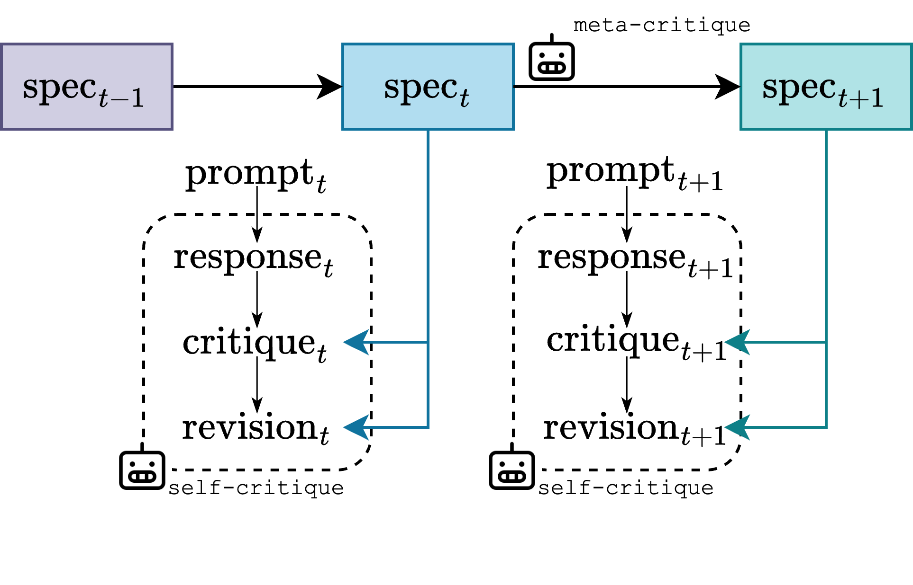

# Meta Self-Critique of LLMs 🌀
 [](https://www.arxiv.org/abs/2502.07985)
> tl;dr: we improve self-critique for LLMs by optimizing the prompts on the fly at test-time, dynamically adapting a safety specification.

We propose a novel dynamic safety framework that optimizes language model (LM) safety reasoning at inference time without modifying model weights. Building on recent advances in self-critique methods, our approach leverages a meta-critique mechanism that iteratively updates safety prompts—termed specifications—to drive the critique and revision process adaptively. This test-time optimization not only improves performance against adversarial jailbreak requests but also in diverse general safety-related tasks, such as avoiding moral harm or pursuing honest responses. Our empirical evaluations across several language models demonstrate that dynamically optimized safety prompts yield significantly higher safety scores compared to fixed system prompts and static self-critique defenses. 


## High-level overview



>  A self-critique loop can be parameterized to depend on a textual specification, $\mbox{spec}_t$, which can be optimized on-the-fly with a meta-critique prompt, resulting in safer model behaviors.

## Experiments

Execute the `run_experiment.py` script to perform MetaSC with any model provider that supports the OpenAI API spec, over the jailbreak attack task from the paper.

Pre-requisities: `datasets`, `openai` libraries.

Simply specify the appropiate model identifiers and API keys if needed. We have examples with ollama and lambdalabs in the code.


## Citation

If you find this work useful for your research, please consider citing the article:

```
@inproceedings{
    gallego2025metasc,
    title={Meta{SC}: Test-Time Safety Specification Optimization for Language Models},
    author={Victor Gallego},
    booktitle={ICLR 2025 Workshop on Foundation Models in the Wild},
    year={2025},
    url={https://openreview.net/forum?id=VGORTi7O5e}
}
```
